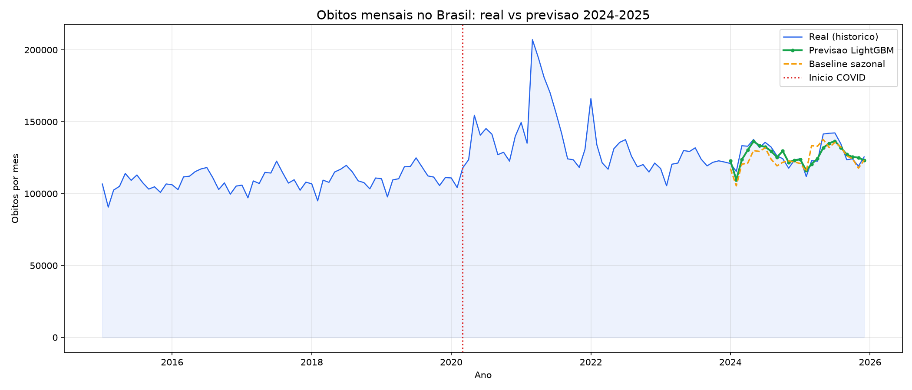

# Previsao de Obitos Mensais no Brasil

Previsao do numero de obitos mensais registrados no Sistema de Informacao sobre Mortalidade (SIM/DATASUS), agregados por mes e unidade federativa, utilizando 30 anos de historico.

## 1. O problema e por que importa

O Brasil registra cerca de 1,5 milhao de obitos por ano. Prever o volume mensal de obitos permite ao Ministerio da Saude dimensionar leitos, farmacos, campanhas e vigilancia em saude de forma antecipada.

Uma previsao confiavel funciona como linha de base para detectar mudancas reais: surtos, desastres e outros eventos de saude publica aparecem como desvios entre o previsto e o observado.

## 2. Os dados

Fonte: **DATASUS** (Departamento de Informatica do SUS), sistema SIM.

Portal: https://dadosabertos.saude.gov.br/dataset/sim

Periodo: **1996 a 2025** (30 anos), obtidos em JSON diretamente do S3 oficial do Governo Federal. Volume total: ~40 GB (30 arquivos, um por ano, ~1,5 milhao de registros por ano).

Para este trabalho, os obitos foram agregados em **series mensais por unidade federativa**:

- 9.420 pontos (360 meses x 27 UFs)
- Series nacional: pico de **207.106 obitos em marco de 2021** (auge da COVID-19)
- Media de ~96.700 obitos por mes no periodo

## 3. Preprocessamento

Extracao e concatenacao dos ZIPs (particoes por ano), seguida da agregacao por (ano, mes, UF). Para cada linha (mes-UF) foram derivadas features:

- SENO/COS: posicao do mes no ciclo anual (sazonalidade)
- TEND: indice temporal por UF (tendencia)
- LAG_1, LAG_2, LAG_6, LAG_12: obitos de 1, 2, 6 e 12 meses atras
- ROLL_3, ROLL_12: medias moveis de 3 e 12 meses
- COVID: indicador do periodo de pandemia (mar/2020 a dez/2022)
- POS: indicador do periodo pos-pandemia (2023 em diante)

Baseline: prever cada mes como o mesmo mes do ano anterior (sazonal ingenuo).

## 4. Modelos testados

| Modelo | Descricao |
|--------|-----------|
| LightGBM global | Um unico modelo para as 27 UFs, com UF como variavel categorica |

Hiperparametros: n_estimators=800, learning_rate=0.05, num_leaves=127, max_depth=10, min_child_samples=30, subsample=0.8, colsample_bytree=0.7.

Divisao temporal: treino 1996-2023 (324 meses), teste 2024-2025 (24 meses), sem embaralhamento.

## 5. Resultados

| Modelo | MAE | RMSE |
|--------|-----|------|
| Baseline sazonal | 5.568 | 6.673 |
| **LightGBM global** | **3.591** | 4.412 |

O modelo reduziu o MAE em **35,5%** frente ao baseline, com erro medio de **2,8% do volume mensal** de obitos. Venceu o baseline em 25 das 27 UFs.



## 6. O que nao funcionou

**Classificacao binaria evitavel/nao-evitavel**: tentamos prever evitabilidade a partir de dados demograficos (idade, sexo, raca, escolaridade, local do obito). Random Forest e Gradient Boosting pararam em accuracy de 58% e AUC de 0,61, com teto claro nas features disponiveis: sem conhecer a causa do obito, o perfil demografico nao explica evitabilidade. A tarefa foi abandonada.

**Classificacao multiclasse (21 capitulos CID-10)**: accuracy de 16%. O modelo nao consegue prever a causa da morte so com dados demograficos. Abandonada.

**Modelo de serie nacional unico**: a serie agregada do Brasil em um unico modelo resultou pior que o baseline (MAE 6.140 vs 5.568). O modelo global por UF resolveu o problema: usa mais dados e captura tendencias regionais.

**Definicao ampla de causas evitaveis**: a primeira versao do criterio (todos os capitulos A-J, V-Y) marcou 67% dos obitos como evitaveis, inutil para qualquer separacao. Descartada.

## 7. Limitacoes

O baseline sazonal e forte em series estaveis como esta; o ganho de 35,5% vem sobretudo dos estados com tendencia propria no periodo.

O modelo assume que os padroes demograficos e epidemiologicos do passado se mantem. Pandemias e desastres nao podem ser antecipados.

Os dados de 2025 ainda sao preliminares e podem ser revisados pelo DATASUS.

O erro agregado nacional (3.591 obitos/mes) mascara divergencias maiores em estados com volume pequeno de obitos.

## Como reproduzir

```bash
git clone https://github.com/Weversson/Projeto_IML.git
cd Projeto_IML
python -m venv .venv

# No Linux / macOS:
source .venv/bin/activate
pip install -r requirements.txt

# No Windows (Git Bash ou PowerShell):
source .venv/Scripts/activate   # no Git Bash
# ou: .venv\Scripts\activate     # no PowerShell/CMD
pip install -r requirements.txt
```

Execucao de demonstracao rapida via linha de comando:

```bash
# Prever obitos para um estado e mes especificos:
python prever.py --uf SP --ano 2024 --mes 7

# Visualizar resumo de avaliacao nacional no periodo de teste:
python prever.py --resumo
```

Abrir `notebooks/notebook_mortalidade.ipynb` no Colab ou localmente. O notebook baixa a serie agregada e o modelo treinado diretamente do GitHub Releases:

https://github.com/Weversson/Projeto_IML/releases

Uso do modelo em outro ambiente:

```python
import joblib
import pandas as pd

lgbm = joblib.load('models/previsao_obitos_uf_lgbm.pkl')

# Construir as features na ordem exata do treinamento:
# UF, SENO, COS, TEND, COVID, POS, LAG_1, LAG_2, LAG_6, LAG_12, ROLL_3, ROLL_12, MES
# O detalhamento esta no notebook, secao 3.
```